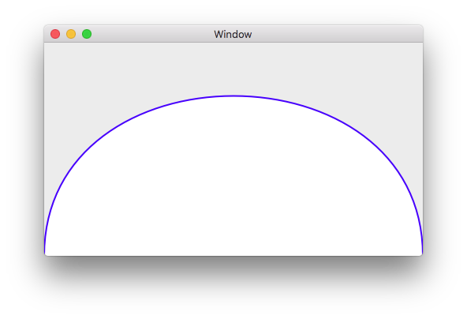

# Xamarin.MacでCALayerにベジェ曲線を描画する

Xamarin.MacでCALayerにベジェ曲線を描画するサンプルです。

ポイントを抜粋

    public partial class SampleView : AppKit.NSView, ICALayerDelegate
    {
        private CALayer bgLayer;

        #region Constructors

        // Called when created from unmanaged code
        public SampleView(IntPtr handle) : base(handle)
        {
            Initialize();
        }

        // Called when created directly from a XIB file
        [Export("initWithCoder:")]
        public SampleView(NSCoder coder) : base(coder)
        {
            Initialize();
        }

        // Shared initialization code
        void Initialize()
        {
            bgLayer = new CALayer();
            this.Layer = bgLayer;
            this.WantsLayer = true;
            this.LayerContentsRedrawPolicy = NSViewLayerContentsRedrawPolicy.OnSetNeedsDisplay;
            this.Layer.Delegate = this;
        }

        #endregion

        /// 

        /// レイアウトの設定
        /// 

        public override void Layout()
        {
            base.Layout();
            this.Layer.Frame = this.Frame;
        }

        [Export("drawLayer:inContext:")]
        public void DrawLayer(CALayer layer, CoreGraphics.CGContext context)
        {
            NSGraphicsContext.GlobalSaveGraphicsState();
            NSGraphicsContext graphicsContext = NSGraphicsContext.FromGraphicsPort(context, true);
            NSGraphicsContext.CurrentContext = graphicsContext;

            NSBezierPath path = new NSBezierPath();
            //ベジェ曲線
            var x1 = this.Frame.Left;
            var y1 = this.Frame.Top;
            var x2 = this.Frame.Right;
            var y2 = this.Frame.Bottom;
            path.MoveTo(new CoreGraphics.CGPoint(x1, y1));
            path.CurveTo(new CoreGraphics.CGPoint(x2, y1),
                         new CoreGraphics.CGPoint(x1, y2),
                         new CoreGraphics.CGPoint(x2, y2));
            //背景は白
            NSColor.White.Set();
            path.Fill();
            //線は青
            NSColor.Blue.Set();
            //線の太さ
            path.LineWidth = 2;
            path.Stroke();

            NSGraphicsContext.GlobalRestoreGraphicsState();
        }

    }
