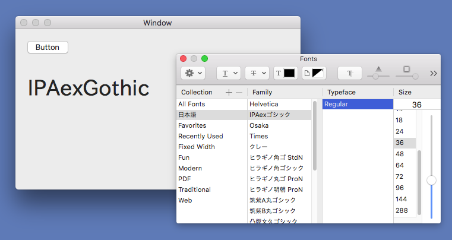
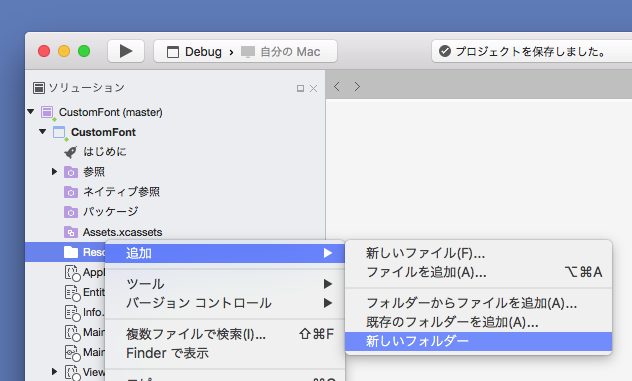
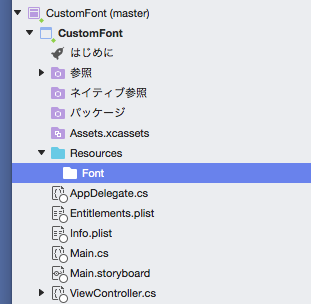
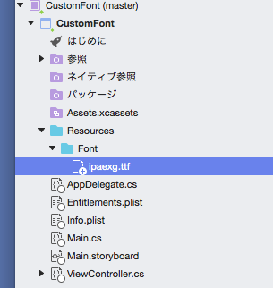
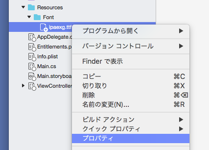
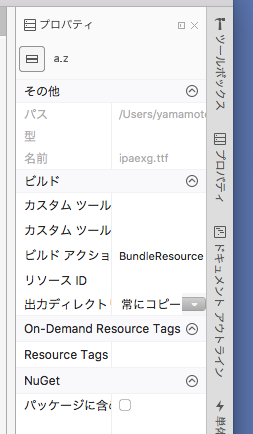
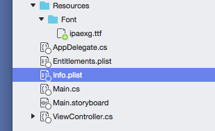
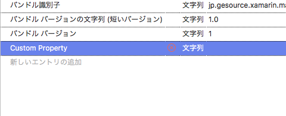
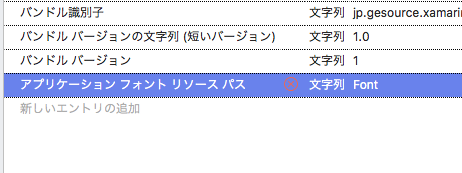

# Xamarin.Macアプリケーションにカスタムフォントを組み込む

Xamarin.Macアプリケーションにカスタムフォントを組み込むサンプルアプリケーションです。

IPAフォントを使用させていただきました。

* [IPAexフォント/IPAフォント | IPAフォントのダウンロードサイトです](https://ipafont.ipa.go.jp/)

## Xamarin.Macアプリケーションにカスタムフォントを組み込むには

次の手順で、フォントをアプリケーションに組み込みます。

1. プロジェクトにフォントを追加する
2. フォントの場所を設定する
3. カスタムフォントを使う

### プロジェクトにフォントを追加する

Resourcesフォルダーを右クリックして、「追加」→「新しいフォルダー」を選択し、Fontフォルダーを作成する。

ttfファイルをFontフォルダーにドロップして、Fontフォルダーにttfファイルをコピーする。

ttfファイルを右クリックして「プロパティ」を選択する。

プロパティウィンドウの「ビルド」→「出力ディレクトリにコピー」を「常にコピー」に変更する。

### フォントの場所を設定する

info.plitファイルを開き、ウィンドウの下にあるタブから「ソース」を選択する。

「新しいエントリの追加」をダブルクリックして、エントリを追加する。

プロパティのプルダウンメニューから「アプリケーション フォント リソース パス」を選択する。
値にフォントファイルを保存したフォルダーの名前(Font)を入力する。

### カスタムフォントを使う

    var font = NSFont.FromFontName("mplus-1m-bold", (nfloat)16.0);
    TextField.Font = font;
