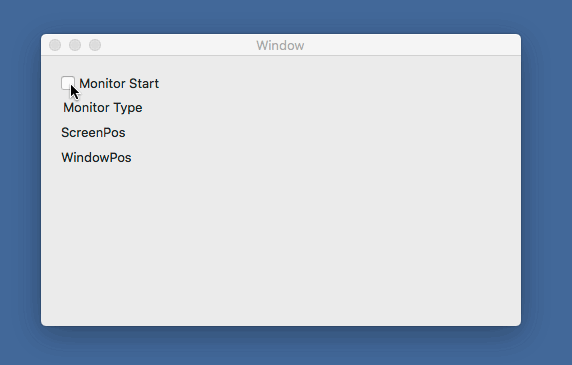

# Xamarin.Macでマウスカーソルの位置を取得する

アプリケーションがアクティブでないときや、マウスカーソルがウィンドウ外にあるときにもマウスカーソルの位置を取得するサンプルアプリケーションです。

## Event Monitor

マウスカーソルの位置を取得するには、Event Monitorを使用します。

アプリケーションがアクティブなときはLocal Event Monitorを使用して、マウスカーソルの座標を取得します。

    localEventMonitor = NSEvent.AddLocalMonitorForEventsMatchingMask(
        NSEventMask.MouseMoved,
        (theEvent) => /* イベント処理 */; )

アプリケーションがアクティブでないときはGlobal Event Monitorを使用して、マウスカーソルの座標を取得します。

    globalEventMonitor = NSEvent.AddGlobalMonitorForEventsMatchingMask(
        NSEventMask.MouseMoved,
        (theEvent) => /* イベント処理 */; );

モニタリングを終了するときは、NSEvent.RemoveMonitor()を使用します。

    NSEvent.RemoveMonitor(globalEventMonitor);
    NSEvent.RemoveMonitor(localEventMonitor);

* 参考：[Monitoring Events](https://developer.apple.com/library/archive/documentation/Cocoa/Conceptual/EventOverview/MonitoringEvents/MonitoringEvents.html#//apple_ref/doc/uid/10000060i-CH15-SW3)

## NSEventから画面上の座標を取得する

Global Monitorのときは、NSEventのLocationInWindowで画面上の座標を取得できます。

Local Monitorのときは、マウスカーソルがアプリケーションのウィンドウ上にあるときはウィンドウ上の座標、マウスカーソルがアプリケーションのウィンドウ外にあるときは画面上の座標を返します。

マウスカーソルがウィンドウ外にあるときはNSEventのWindowがnullになるようなので、この値を使って判定しました。

    CGPoint p;
    if (theEvent.Window != null)
    {
        var rect = theEvent.Window.ConvertRectToScreen(new CGRect(theEvent.LocationInWindow, new CGSize(0, 0)));
        p = rect.Location;
    }
    else
    {
        p = theEvent.LocationInWindow;
    }

画面上の座標からウィンドウ上の座標に変換するには、ConvertScreenToBase()を使用します。

    var localPoint = this.View.Window.ConvertScreenToBase(p);

## ソースコード

ソースコードの一部を掲載します。

    public partial class ViewController : NSViewController
    {
        private NSObject globalEventMonitor;
        private NSObject localEventMonitor;

        public override void ViewDidLoad()
        {
            base.ViewDidLoad();

            // Do any additional setup after loading the view.
            CheckBoxMonitoring.Activated += (sender, e) =>
            {
                if (CheckBoxMonitoring.State == NSCellStateValue.On)
                    StartMonitoring();
                if (CheckBoxMonitoring.State == NSCellStateValue.Off)
                    StopMonitoring();
            };
        }
        private void PrintMouseLocation(string monitor, CGPoint p)
        {
            LabelMonitor.StringValue = $"Monitor: {monitor}";
            LabelScreen.StringValue = $"Screen Pos: {p.X:F4} {p.Y:F4}";
            var localPoint = this.View.Window.ConvertScreenToBase(p);
            LabelWindow.StringValue = $"Window Pos: {localPoint.X:F4} {localPoint.Y:F4}";
        }
    }
