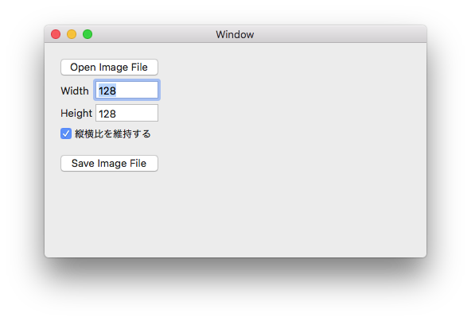

# NSImageのサイズを変更する

## 概要

NSImageのサイズを変更し、PNG画像をファイルに保存するアプリケーションです。

## ソースコード

サイズを変更するResize()メソッドは次のようになっています。

    /// 

    /// 元画像sourceをnewSizeに拡縮したPNGデータを返します
    /// 

    private static NSData Resize(CGImage source, CGSize newSize)
    {
        // メモリ内のピクセルの各コンポーネントに使用するビット数
        nint bitsPerComponent = 8;
        // ビットマップの1行あたりに使用するメモリのバイト数
        // 値0を渡すと、自動的に値が計算されます
        nint bytesPerRow = 0;
        // 色空間
        var colorSpace = CGColorSpace.CreateDeviceRGB();
        var bitmapInfo = CGImageAlphaInfo.PremultipliedLast;
        using (var bitmapContext = new CGBitmapContext(
                        IntPtr.Zero,
                        (nint)newSize.Width,
                        (nint)newSize.Height,
                        bitsPerComponent,
                        bytesPerRow,
                        colorSpace,
                        bitmapInfo))
        {
            var rect = new CGRect(new CGPoint(0, 0), newSize);
            bitmapContext.DrawImage(rect, source);
            var cgImage = bitmapContext.ToImage();
            return ConvertImageToPng(cgImage);
        }
    }

    /// 

    /// imageをPNGデータに変換します
    /// 

    private static NSData ConvertImageToPng(CGImage image)
    {
        var storage = new NSMutableData();
        var dest = CGImageDestination.Create(storage, MobileCoreServices.UTType.PNG, imageCount: 1);
        dest.AddImage(image);
        dest.Close();
        return storage;
    }
