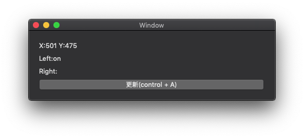

# マウスカーソルの座標と押されているボタンを取得するサンプル

Xamarin.Macで、マウスの座標と押されているマウスのボタンを取得するサンプルアプリケーションです。

更新ボタン(またはcontrol+Aキー)を押すと、その時のマウスの座標と押されているマウスのボタンを表示します。

## 説明

### マウスの座標を取得するには

マウスの座標はNSEventクラスのCurrentMouseLocationプロパティで取得します。

座標が画面座標になります。画面の左下の座標が(X:0, Y:0)になります。

    var location = NSEvent.CurrentMouseLocation;

### 押されているマウスのボタンを取得するには

押されているマウスのボタンはNSEventクラスのCurrentPressedMouseButtonsプロパティで取得します。

    var buttons = NSEvent.CurrentPressedMouseButtons;

## ソースコード

マウスカーソルの座標通されているマウスのボタンを取得するコードです。

    var location = NSEvent.CurrentMouseLocation;
    LabelMouseLocation.StringValue = $"X:{location.X} Y:{location.Y}";

    var buttons = NSEvent.CurrentPressedMouseButtons;
    var left = ((buttons & (1 << 0)) > 0) ? "on" : "";
    var right = ((buttons & (1 << 1)) > 0) ? "on" : "";
    LabelMouseLeftButton.StringValue = $"Left:{left}";
    LabelMouseRightButton.StringValue = $"Right:{right}";

