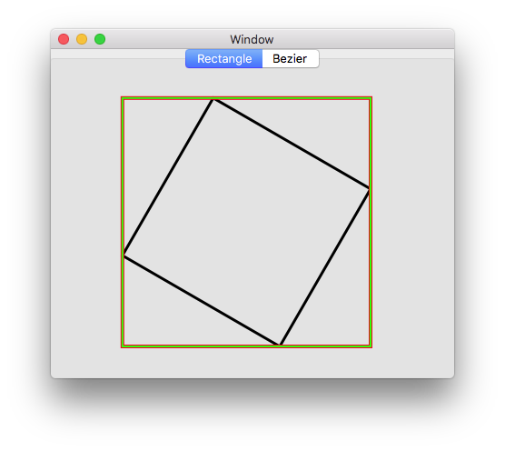
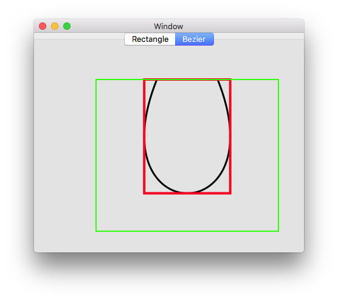

# Xamarin.MacでNSBezierPathのBoundsとControlPointBoundsを描画する

NSBezierPathのBoundsとControlPointBoundsの違いを確認するため、四角形とベジェ曲線のoundsとControlPointBoundsを描画しました。

BoundsとControlPointBoundsは、ベジェ曲線の制御点の扱いが異なっています。

## 四角形

## ベジェ曲線

