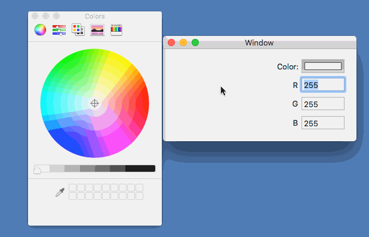

# NSColorWellSample

Xamarin.MacでNSColorWellを使ったサンプルアプリケーションです。

NSColorWellで色を選択すると、選択された色をNSViewに表示し、NSTextFieldにR/G/Bの各値を表示します。

## 色が選択されたときのイベントを設定する

色が選択されたときに実行する処理を、NSColorWellのActivatedイベントに登録します。

    ColorWell.Activated += (sender, e) => { 実行する処理 }

NSColorWellで色が選択されるたびに、処理が実行されます。

## RGBの各値を取得する

次のようにして、RGBの値を取得しています。

    TextFieldR.IntValue = (int)(color.RedComponent * 255);
    TextFieldG.IntValue = (int)(color.GreenComponent * 255);
    TextFieldB.IntValue = (int)(color.BlueComponent * 255);

color.RedComponentのところで、次のエラーが発生することがありました。

> Terminating app due to uncaught exception 'NSInvalidArgumentException', reason: '*** -getRed:green:blue:alpha: not valid for the NSColor Generic Gray Gamma 2.2 Profile colorspace 1 1; need to first convert colorspace.'
*** First throw call stack:

対策として、次のコードを入れています。

    color = color.UsingColorSpace(NSColorSpace.GenericRGBColorSpace);
