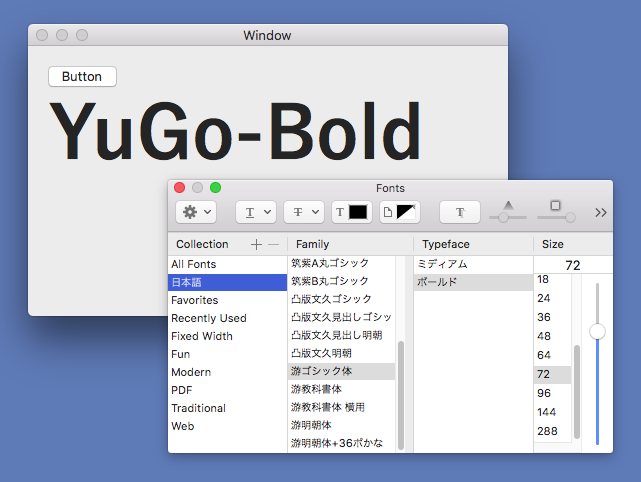

# NSFontPanelSample

Xamarin.MacでNSFontPanelを使用するサンプルアプリケーションです。

## NSFontPanelを表示するには

NSFontPanelのオブジェクトを取得します。

    NSFontPanel fontPanel = NSFontManager.SharedFontManager.FontPanel(true);

選択されているフォントを設定します。

    fontPanel.SetPanelFont(Label.Font, false);

フォントが選択されたときにイベントを受け取るようにします。  
イベントを受け取るには、INSWindowDelegateを継承する必要があります。

    fontPanel.Delegate = this;

NSFontPanelをキーウィンドウにして前面に表示します。

    fontPanel.MakeKeyAndOrderFront(this);

## 選択されたフォントを取得するには

INSWindowDelegateを継承したクラスで、changeFontメソッドを作成します。

        [Export("changeFont:")]
        public void ChangeFont(NSFontManager sender)
        {
        }

NSFontManagerのConvertFont()メソッドでフォントを取得します。

        Label.Font = sender.ConvertFont(Label.Font);

## ソースコード

ソースコードを一部抜粋します。

    public partial class ViewController : NSViewController, INSWindowDelegate
    {
        void Button_Activated(object sender, EventArgs e)
        {
            // NSFontPanelのオブジェクトを取得する
            NSFontPanel fontPanel = NSFontManager.SharedFontManager.FontPanel(true);
            // 選択されているフォントを設定する
            fontPanel.SetPanelFont(Label.Font, false);
            fontPanel.Delegate = this;
            // キーウィンドウにして前面に表示する
            fontPanel.MakeKeyAndOrderFront(this);
        }

        /// 

        /// フォントが選択されたときに呼ばれる
        /// 

        [Export("changeFont:")]
        public void ChangeFont(NSFontManager sender)
        {
            // 選択されたフォントを取得する
            Label.Font = sender.ConvertFont(Label.Font);
        }
    }
