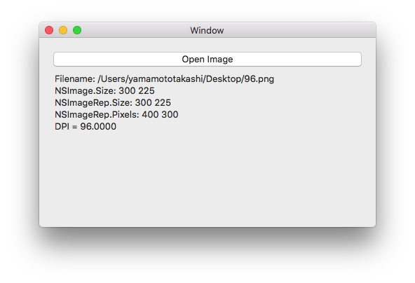

# 画像サイズと解像度を取得する

## 概要

画像ファイルを読み込み、画像サイズやピクセル数、DPIを取得します。

## ソースコード

NSImageやNSImageRepのSizeは、DPIを考慮した表示場のサイズ、  
NSImageRepのPixelsWideとPixelsHighは、画像のピクセル数です。

これらの値からDPIを算出します。

    private void ShowImageInfo(string filename)
    {
        var sb = new System.Text.StringBuilder();
        sb.AppendLine($"Filename: {filename}");

        var nsImage = new NSImage(filename);
        // 画像サイズ
        sb.AppendLine($"NSImage.Size: {nsImage.Size.Width} {nsImage.Size.Height}");

        //var nsImageRep = NSImageRep.ImageRepFromFile(filename);
        var nsImageRep = NSBitmapImageRep.ImageRepsWithData(nsImage.AsTiff())[0];
        // 画像サイズ
        sb.AppendLine($"NSImageRep.Size: {nsImageRep.Size.Width} {nsImageRep.Size.Height}");
        // ピクセル数
        sb.AppendLine($"NSImageRep.Pixels: {nsImageRep.PixelsWide} {nsImageRep.PixelsHigh}");

        // DPI
        var dpi = Math.Ceiling((72.0 * nsImageRep.PixelsWide) / nsImageRep.Size.Width);
        sb.AppendLine($"DPI = {dpi:F4}");

        Label.StringValue = sb.ToString();
    }
