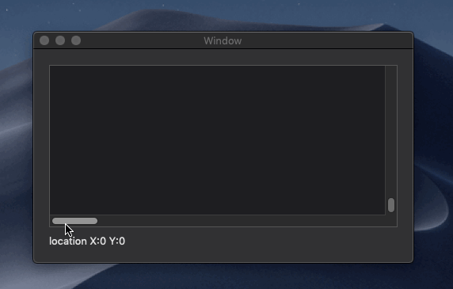

# NSScrollViewのスクロールのイベントを取得する

Xamarin.Macで、NSScrollViewのスクロールのイベントを取得するサンプルアプリケーションです。

スクロールすると、現在の左下座標を表示します。

## 説明

NSScrollViewにはスクロールのイベントはありません。

NSScrollViewのスクロールのイベントを取得するには、NSScrollViewのContentViewの"NSViewBoundsDidChangeNotification"の通知を受け取ります。

## ソースコード

    NSNotificationCenter.DefaultCenter.AddObserver(
        new NSString("NSViewBoundsDidChangeNotification"),
        (NSNotification notification) =>
        {
            var contentView = notification.Object as NSClipView;
            var location = contentView.Bounds.Location;
            Label.StringValue = new NSString($"location X:{location.X} Y:{location.Y}");
        },
        ScrollView.ContentView);

