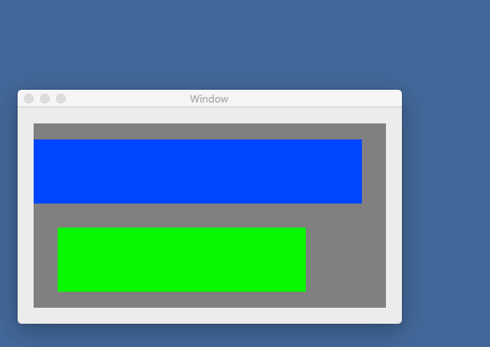

# NSViewAddConstrains

C#のコードでオートレイアウトの設定をするサンプルアプリケーションです。

## 説明

オートレイアウトを解除します。

    greenView.TranslatesAutoresizingMaskIntoConstraints = false;

制約を設定するViewとViewの名前を設定します。  
ここでは、blueViewに対して、"blueView"という名前をつけています。

    var viewsDictionary = NSDictionary.FromObjectsAndKeys(
        new NSObject[] { blueView },
        new NSObject[] { new NSString("blueView") }
    );

変数名と変数の値を設定します。  
ここでは、leftPaddingの値を0、rightPaddingの値を30にしています。

    var metricsDic = NSDictionary.FromObjectsAndKeys(
        new NSObject[] { new NSNumber(0), new NSNumber(30), },
        new NSObject[] { new NSString("leftPadding"), new NSString("rightPadding") }
    );

制約を追加します。

    mainView.AddConstraints(NSLayoutConstraint.FromVisualFormat(
        "H:|-leftPadding-[blueView]-rightPadding-|", 0, metricsDic, viewsDictionary));

blueViewはviewsDictionaryで設定したViewの名前、  
leftPaddingとrightPaddingはmetricsDicで設定した変数名です。

