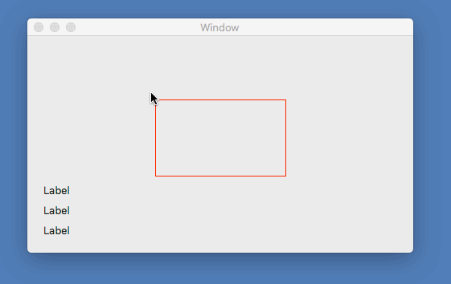

# NSViewConvertPoint

NSView上のマウスイベントの座標を表示します。

画面左上基準の座標・ウィンドウ左上基準の座標、ビュー左上基準の座標を表示します。

## 解説

NSEventのLocationInWindowは、ウィンドウの左上を原点としたマウスポインタの座標を返します。

NSEventのCurrentMouseLocationは、画面の左上を原点としたマウスポインタの座標を返します。

NSViewのConvertPointFromViewに、引数としてLocationInWindowを渡すと、NSViewの左上を原点としたマウスポインタの座標を返します。

    public override void MouseMoved(NSEvent theEvent)
    {
        base.MouseMoved(theEvent);
        var locationInWindow = theEvent.LocationInWindow;
        var mouseLocation = NSEvent.CurrentMouseLocation;
        var locationInView = this.ConvertPointFromView(locationInWindow, null);
        OnMouseMoved?.Invoke(this, new MouseEventArgs(locationInWindow, mouseLocation, locationInView));
    }
