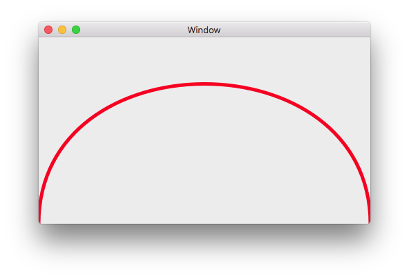

# Xamarin.MacでNSViewのDrawRect()を使ってベジェ曲線を描画するサンプル

Xamarin.MacでNSViewのDrawRect()を使ってベジェ曲線を描画するサンプルです。

## 使い方

実行すると、ベジェ曲線が描画されます。

## 作り方

1. Visual Studio for Macのメニューの「ファイル」→「新しいファイル」→「Mac」→「ビュー」を選択、名前を「SampleView」にして「新規」ボタンを押して作成する。

2. 作成した「SampleView.cs」を開き、以下のコードを追加する。

        public override void DrawRect(CoreGraphics.CGRect dirtyRect)
        {
            var rect = this.Bounds;
            var x1 = rect.Left;
            var y1 = rect.Top;
            var x2 = rect.Right;
            var y2 = rect.Bottom;

            NSBezierPath path = new NSBezierPath();
            path.MoveTo(new CoreGraphics.CGPoint(x1, y1));
            path.CurveTo(new CoreGraphics.CGPoint(x2, y1),
                         new CoreGraphics.CGPoint(x1, y2),
                         new CoreGraphics.CGPoint(x2, y2));
            path.LineWidth = 5;
            NSColor.Red.SetStroke();
            path.Stroke();
        }

3. storyboardファイルをダブクリックして、Xcodeで開く。

4. ViewControllerのViewを選択して、Classを「SampleView」にする。

以上。

