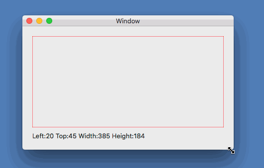

# NSViewFrameChanged

NSViewのサイズが変更された時に通知を受け取るサンプルアプリケーションです。

サイズが変更された時、現在のサイズを表示します。

## 要点

NSViewでは、サイズが変更されるとOnFrameChagnedイベントを実行します。

    public partial class MainView : NSView
    {
        public event EventHandler OnFrameChagned;

        public MainView(IntPtr handle) : base(handle)
        {
            NSView.Notifications.ObserveFrameChanged(
                (sender, e) => OnFrameChagned?.Invoke(this, EventArgs.Empty));
        }
    }

ViewControllerでは、OnFrameChagnedイベントでNSViewのサイズを表示します。

    public partial class ViewController : NSViewController
    {
        public override void ViewDidLoad()
        {
            base.ViewDidLoad();

            // Do any additional setup after loading the view.
            (MainView as MainView).OnFrameChagned += (sender, e) => PrintFrameSize();
        }

