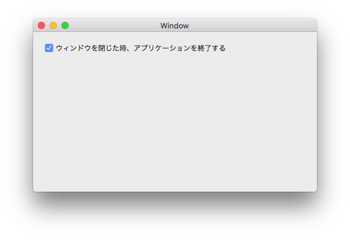

# Xamarin.Macでウィンドウが閉じる時に処理を行うには

### Xamarin.Macでウィンドウが閉じる時に処理を行う

 Xamarin.Macではウィンドウが閉じる時、NSWindowのWillCloseイベントが発生します。

    public partial class MainWindow : NSWindow
    {
        public override void AwakeFromNib()
        {
            base.AwakeFromNib();
            this.WillClose += WindowClosed;
        }
        /// 

        /// ウィンドウが閉じる時
        /// 

        private void WindowClosed(object sender, EventArgs e)
        {
            // ウィンドウが閉じる時に行う処理をここに記述する
        }
    }

### メインウィンドウを閉じた時にアプリケーションを終了する

メインウィンドウを閉じた時にアプリケーションを終了するには、ウィンドウを閉じた時に「NSApplication.SharedApplication.Terminate()」を実行します。

    public partial class MainWindow : NSWindow
    {
        public override void AwakeFromNib()
        {
            base.AwakeFromNib();
            this.WillClose += WindowClosed;
        }
        /// 

        /// ウィンドウが閉じる時
        /// 

        private void WindowClosed(object sender, EventArgs e)
        {
            NSApplication.SharedApplication.Terminate(this);
        }
    }

