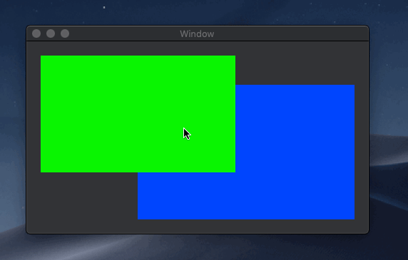

# Xamarin.Macでコンテキストメニューを表示する

Xamarin.Macでコンテキストメニューを表示するサンプルです。

## コンテキストメニューの表示

MenuForEventメソッドをオーバーライドし、表示するコンテキストメニューを返します。

    public override NSMenu MenuForEvent(NSEvent theEvent)
    {
        var menu = new NSMenu();
        menu.AddItem(
            new NSMenuItem(
                "Menu Item",
                (sender, e) => Debug.WriteLine($"{((NSMenuItem)sender).Title} Clicked")));
        return menu;
    }

## Controlキー+左クリックと、右クリックのコンテキストメニューの動作の違い

Controlキー+左クリックのときと、右クリックのときでは、コンテキストメニューの動作に違いがあります。

サンプルアプリケーションでは、緑色のNSViewと青色のNSViewがあります。
青色のNSViewはコンテキストメニューを表示しますが、緑色のNSViewはコンテキストメニューを表示しません。

2つのNSViewが重なっている部分を右クリックしたとき、コンテキストメニューが表示されます。  
Controlキー+左クリックでは、コンテキストメニューは表示されません。

右クリックの場合、上位のコントロールがコンテキストメニューを表示しなければ下位のコントロールのコンテキストメニューを表示します。
Controlキー+左クリックの場合は、下位のコントロールのコンテキストメニューは表示されません。
