# Xamarin.Macのサンプルプロジェクト

Xamarin.Macのサンプルプロジェクトです。

## [CALayerBezierSample](CALayerBezierSample/README.md)

CALayerにベジェ曲線を描画するサンプルプロジェクトです。

## [DragSample](DragSample/README.md)

NSView上に描画した図形をドラッグして移動するサンプルアプリケーションです。

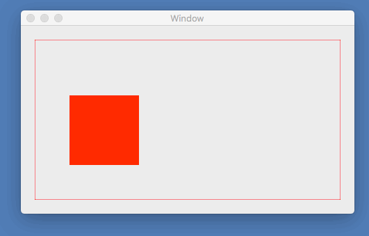

## [NSImageのサイズを変更する](ImageResize/)

NSImageのサイズを変更し、PNG画像をファイルに保存するアプリケーションです。

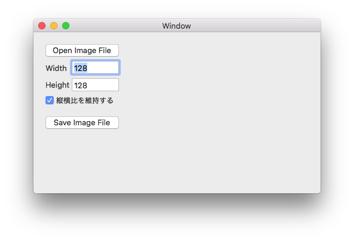

## [MacSystemDrawing](MacSystemDrawing/README.md)

Xamarin.Macでプロジェクトのターゲットフレームワークに「Xamarin.Mac Modern」を選択していると、System.Drawingを使用できません。

System.Drawingの代わりに「ZKWeb.System.Drawing」を使ったサンプルアプリケーションです。

## [MacVersion](MacVersion/README.md)

OSのバージョンによって使用するAPIを変えたいとき、OSのバージョンを確認する必要があります。

MacOSのバージョンを確認する方法を紹介します。

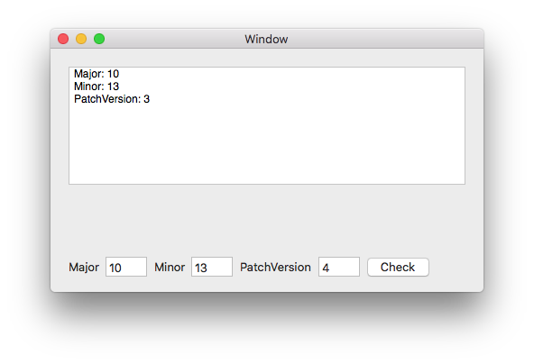

## [MultiLine](MultiLine/README.md)

NSTextFieldに複数行の文字列を表示します。

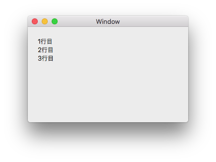

## [NSBezierPathBoundsProperty](NSBezierPathBoundsProperty/README.md)

NSBezierPathのBoundsとControlPointBoundsの違いを確認するため、四角形とベジェ曲線のoundsとControlPointBoundsを描画しました。

## [NSBezierPathLineDash](NSBezierPathLineDash/README.md)

NSBezierPathを使って点線を描画するサンプルアプリケーションです。

スライダーで線の太さ・点線の線・空白の長さを指定すると、点線を描画します。

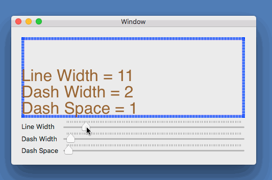

## [NSColorWellSample](NSColorWellSample/README.md)

Xamarin.MacでNSColorWellを使ったサンプルアプリケーションです。

NSColorWellで色を選択すると、選択された色をNSViewに表示し、NSTextFieldにR/G/Bの各値を表示します。

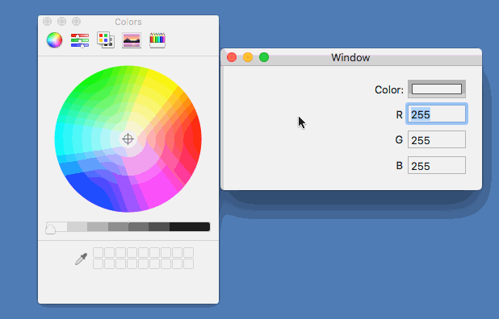

## [NSFontPanelSample](NSFontPanelSample/README.md)

Xamarin.MacでNSFontPanelを使用するサンプルアプリケーションです。

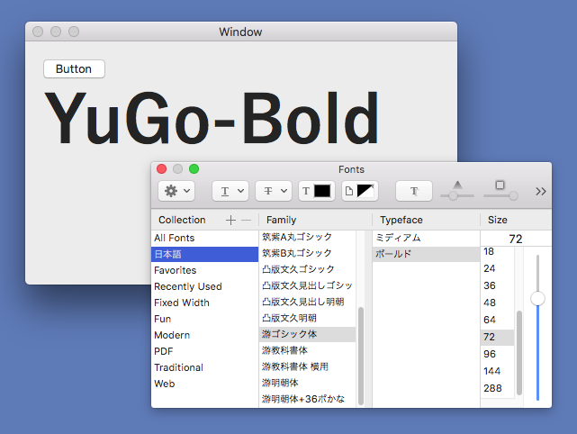

## [画像サイズと解像度を取得する](NSImageDPI/)

画像ファイルを読み込み、画像サイズやピクセル数、DPIを取得します。

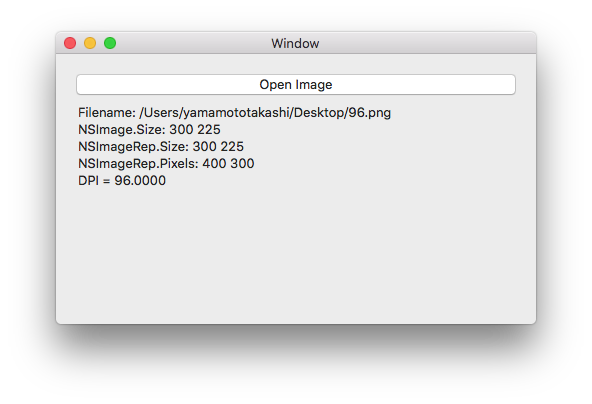

## [NSImageに画像を読み込む方法](NSImageLoad/)

NSImageに画像を読み込む方法を4つ紹介します。

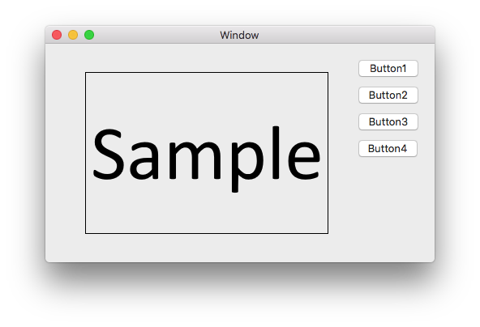

## [NSScrollViewContentCentered](NSScrollViewContentCentered/README.md)

NSScrollViewのコンテンツを中央に表示するサンプルアプリケーションです。

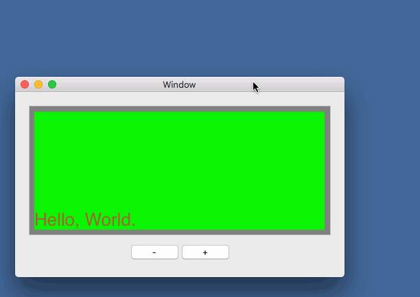

## [NSViewAddConstrains](NSViewAddConstrains/README.md)

C#のコードでオートレイアウトの設定をするサンプルアプリケーションです。

## [NSViewChangeCursor](NSViewChangeCursor/README.md)

NSViewの上にマウスポインタが移動したらマウスカーソルを変更するサンプルアプリケーションです。

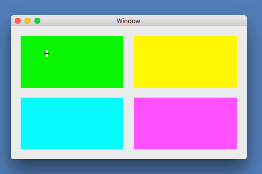

## [NSViewConvertPoint](NSViewConvertPoint/README.md)

NSView上のマウスイベントの座標を表示します。

画面左上基準の座標・ウィンドウ左上基準の座標、ビュー左上基準の座標を表示します。

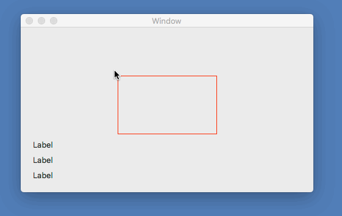

## [NSViewDrawSample](NSViewDrawSample/README.md)

NSViewのDrawRect()を使ってベジェ曲線を描画するサンプルです。

## [NSViewDrawText](NSViewDrawText/README.md)

NSViewに文字列を描画するサンプルアプリケーションです。

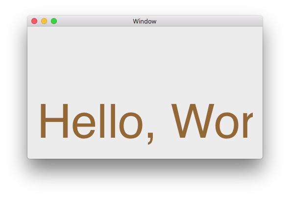

## [NSViewFrameChanged](NSViewFrameChanged/README.md)

NSViewのサイズが変更された時に通知を受け取るサンプルアプリケーションです。

サイズが変更された時、現在のサイズを表示します。

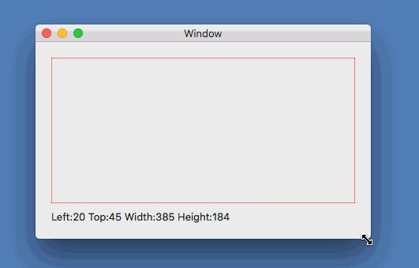

## [NSViewMouseEventSample](NSViewMouseEventSample/README.md)

NSViewのマウスイベントの情報を取得するサンプルアプリケーションです。

NSViewのマウスイベントの情報をログに出力します。

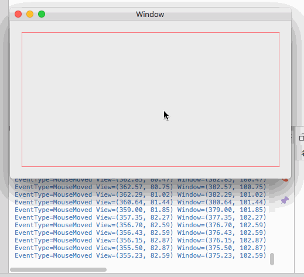

## [NSViewMouseTrackingSample](NSViewMouseTrackingSample/README.md)

NSViewのマウスイベント(MouseEntered/MouseExited/MouseMoved)を受け取るサンプルプロジェクトです。

受け取ったイベントの情報をログに出力します。

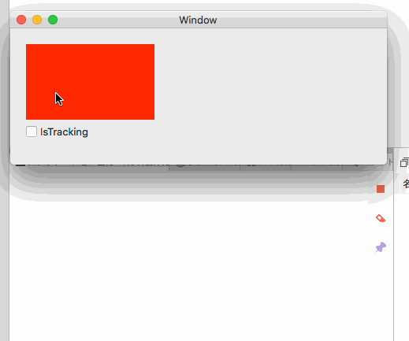

## [NSViewMouseTrackingInVisibleRect](NSViewMouseTrackingInVisibleRect/README.md)

NSTrackingAreaOptionsのinVisibleRectの動作を確認するプログラムです。

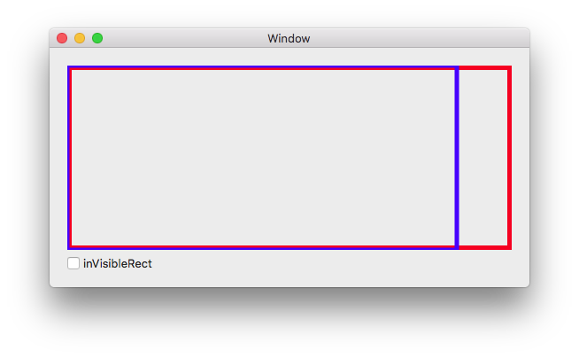

## [NSViewFrameOriginSample](NSViewFrameOriginSample/README.md)

NSViewのSetFrameOrigin()を使って、NSViewの位置を更新するサンプルアプリケーションです。

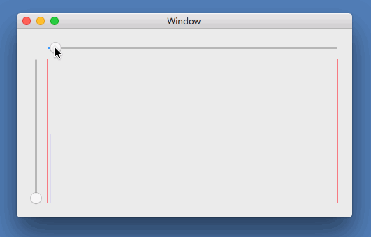

## [NSWindowDidResizeNotification](NSWindowDidResizeNotification/README.md)

ウィンドウのサイズが変更された時に通知を受け取り、ウィンドウサイズを表示します。

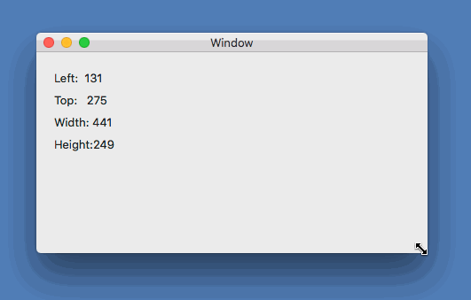

## [NSWindowWillClose](NSWindowWillClose/README.md)

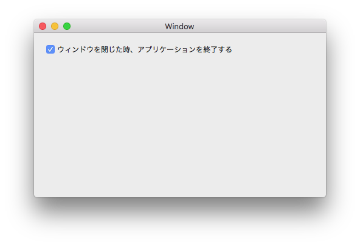

ウィンドウを閉じた時にアプリケーションを終了します。

## [PinchEventSample](PinchEventSample/README.md)

二本指で縮小(ピンチイン/pinch-in)や拡大(ピンチアウト/pinch-out)したときのイベントを受け取るサンプルアプリケーションです。

NSView上でピンチイン・ピンチアウトすると、倍率を表示します。

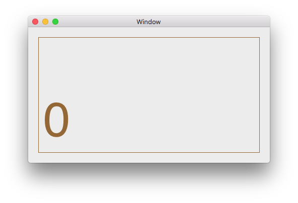

## [ScreenDevice](ScreenDevice/README.md)

表示デバイスの情報を取得します。

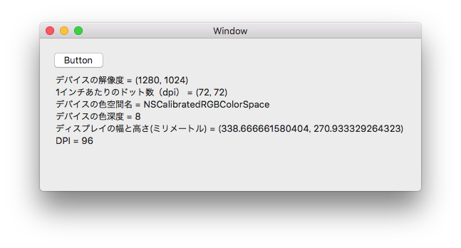

## [StringToPath](StringToPath/README.md)

Xamarin.Macで文字列の輪郭のパスを取得するサンプルアプリケーションです。

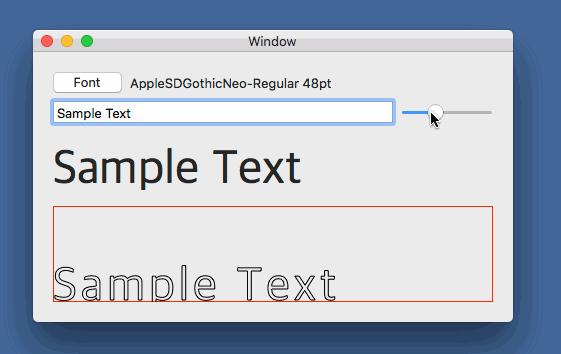

## [ScrollViewEventSample](ScrollViewEventSample/README.md)

NSScrollViewのスクロールイベントを取得するサンプルプロジェクトです。

## [ViewScaleSample](ViewScaleSample/README.md)

NSViewの表示倍率を変更するサンプルアプリケーションです。  
表示領域の大きさは変わりません。

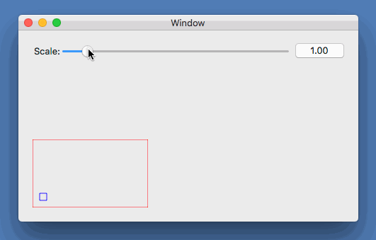

## [ViewScaleSample2](ViewScaleSample2/README.md)

NSViewの表示倍率を変更するサンプルアプリケーションです。  
表示領域の大きさも変わります。

