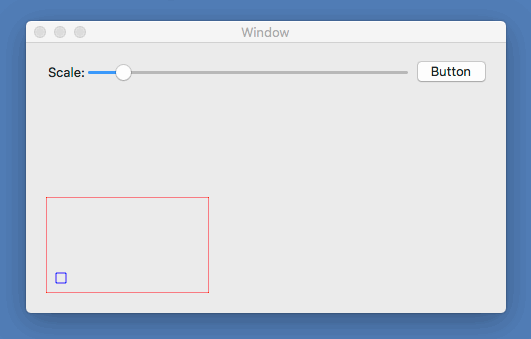

# Xamarin.Macのサンプルプロジェクト

Xamarin.Macのサンプルプロジェクトです。

## [CALayerBezierSample](CALayerBezierSample/README.md)

CALayerにベジェ曲線を描画するサンプルプロジェクトです。

## [DragSample](DragSample/README.md)

NSView上に描画した図形をドラッグして移動するサンプルアプリケーションです。

## [NSBezierPathBoundsProperty](NSBezierPathBoundsProperty/README.md)

NSBezierPathのBoundsとControlPointBoundsの違いを確認するため、四角形とベジェ曲線のoundsとControlPointBoundsを描画しました。

## [NSViewDrawSample](NSViewDrawSample/README.md)

NSViewのDrawRect()を使ってベジェ曲線を描画するサンプルです。

## [NSViewFrameChanged](NSViewFrameChanged/README.md)

NSViewのサイズが変更された時に通知を受け取るサンプルアプリケーションです。

サイズが変更された時、現在のサイズを表示します。

## [NSViewMouseTrackingSample](NSViewMouseTrackingSample/README.md)

NSViewのマウスイベントを受け取るサンプルプロジェクトです。

# [NSWindowDidResizeNotification](NSWindowDidResizeNotification/README.md)

ウィンドウのサイズが変更された時に通知を受け取り、ウィンドウサイズを表示します。

## [ScrollViewEventSample](ScrollViewEventSample/README.md)

NSScrollViewのスクロールイベントを取得するサンプルプロジェクトです。

## [ViewScaleSample](ViewScaleSample/README.md)

NSViewの表示倍率を変更するサンプルアプリケーションです。  
表示領域の大きさは変わりません。

## [ViewScaleSample2](ViewScaleSample2/README.md)

NSViewの表示倍率を変更するサンプルアプリケーションです。  
表示領域の大きさも変わります。

