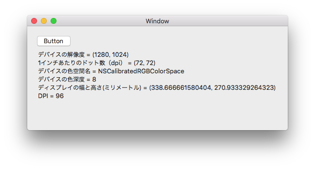

# ScreenDevice

表示デバイスの情報を取得します。

# ソースコード

    void Button_Activated(object sender, EventArgs e)
    {
        List<string> lines = new List<string>();
        // 画面のデバイス情報を取得する
        NSDictionary description = NSScreen.MainScreen.DeviceDescription;

        // デバイスの解像度
        var displayPixelSize = (description.ObjectForKey(new NSString("NSDeviceSize")) as NSValue).CGSizeValue;
        lines.Add($"デバイスの解像度 = ({displayPixelSize.Width}, {displayPixelSize.Height})");

        // 1インチあたりのドット数（dpi）
        var deviceResolution = (description.ObjectForKey(new NSString("NSDeviceResolution")) as NSValue).CGSizeValue;
        lines.Add($"1インチあたりのドット数（dpi） = ({deviceResolution.Width}, {deviceResolution.Height})");

        // デバイスの色空間名
        var deviceColorSpaceName = (description.ObjectForKey(new NSString("NSDeviceColorSpaceName")));
        lines.Add($"デバイスの色空間名 = {deviceColorSpaceName}");

        // デバイスの色深度
        var deviceBitsPerSample = (description.ObjectForKey(new NSString("NSDeviceBitsPerSample")) as NSNumber).Int32Value;
        lines.Add($"デバイスの色深度 = {deviceBitsPerSample}");

        // ディスプレイの幅と高さ(ミリメートル)
        var screenNumber = (description.ObjectForKey(new NSString("NSScreenNumber")) as NSNumber).UInt32Value;
        var displayPhysicalSize = CGDisplay.ScreenSize(screenNumber);
        lines.Add($"ディスプレイの幅と高さ(ミリメートル) = ({displayPhysicalSize.Width}, {displayPhysicalSize.Height})");

        // DPI
        var dpi = (displayPixelSize.Width / displayPhysicalSize.Width) * 25.4f;
        lines.Add($"DPI = {dpi}");

        TextField.StringValue = string.Join("\n", lines);
    }
