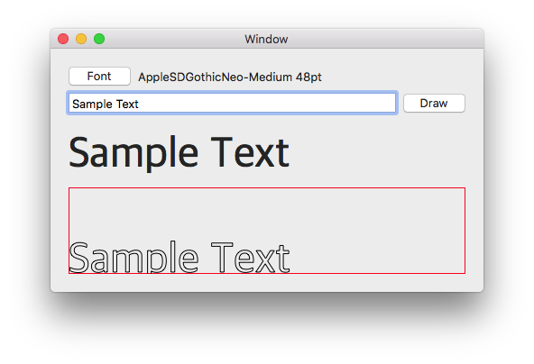

# StringToPath

## 概要

Xamarin.Macで文字列の輪郭のパスを取得するサンプルアプリケーションです。

## ソースコード

フォント(NSFont)と文字列(string)を引数に渡すと、輪郭のパス(NSBezierPath)を返します。

サンプルアプリケーションでは入力は1行に限定しているため、複数行文字列には対応していません。

        static NSBezierPath CreatePath(NSFont font, string text)
        {
            NSBezierPath path = new NSBezierPath();
            path.MoveTo(CGPoint.Empty);

            NSMutableAttributedString attributes = new NSMutableAttributedString(text);
            attributes.AddAttribute(NSStringAttributeKey.Font, font, new NSRange(0, text.Length));

            CTLine ctLine = new CTLine(attributes);
            CTRun[] runs = ctLine.GetGlyphRuns();
            foreach (CTRun run in runs)
            {
                foreach (var glyph in run.GetGlyphs())
                {
                    path.AppendPathWithCGGlyph(glyph, font);
                }
            }
            return path;
        }

NSViewに表示するコードは次のようになります。

    public override void DrawRect(CGRect dirtyRect)
    {
        NSColor.Black.Set();
        NSBezierPath path = CreatePath(font, text);
        path.Stroke();
    }
